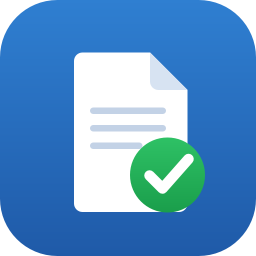

# CorianoSign

App **cross-platform** (macOS Apple Silicon / Windows) per aprire i file **`.p7m`**
(buste CMS/PKCS#7, firma digitale **CAdES** italiana), **verificarne la validità
della firma** ed **estrarre il documento** contenuto.

La verifica è a **validità legale**: oltre all'integrità crittografica, la
catena del certificato del firmatario viene ricondotta a una **CA accreditata**
presente nelle **Trusted List europee (EU LOTL) / italiana (AgID)**, con
controllo di **revoca CRL/OCSP**.

---

## Cosa verifica

| Livello | Controllo |
|--------|-----------|
| **Integrità** | La firma corrisponde al contenuto (hash `message-digest` + firma sui *signed attributes*). Rileva manomissioni del documento. |
| **Certificato** | Titolare, organizzazione, codice fiscale/identificativo, emittente, numero di serie, validità temporale. |
| **Catena / Trust** | Il certificato risale a una CA accreditata nella Trusted List (EU/AgID). |
| **Autenticità lista** | La Trusted List è verificata nella firma XAdES e ancorata all'anchor OJ europeo (vedi sotto). |
| **Marca temporale** | Le firme **CAdES-T** (RFC 3161) sono verificate: impronta, firma della TSA e TSA accreditata; il tempo attestato diventa l'istante di validazione. |
| **Revoca** | Stato di revoca del certificato via CRL/OCSP (opzionale, online). |
| **Firme multiple** | Firme parallele (più firmatari) e **annidate** (`file.pdf.p7m.p7m`). |

---

## Requisiti

- **Python 3.10+** (consigliato 3.12).
  - macOS: `brew install python@3.12`
  - Windows: installer ufficiale da python.org (64 bit).

## Avvio in sviluppo

```bash
# 1. ambiente virtuale
python3.12 -m venv .venv
source .venv/bin/activate            # Windows: .venv\Scripts\activate

# 2. dipendenze
pip install -r requirements.txt
pip install -e .

# 3. avvio interfaccia grafica
python -m corianosign
```

La Trusted List si aggiorna **automaticamente all'avvio** (per impostazione
predefinita ogni **7 giorni**, configurabile in *Impostazioni*). Al primo avvio
l'app la scarica da sola; puoi comunque forzare l'aggiornamento con
**«Aggiorna Trusted List»**. La cache è locale, quindi poi funziona offline.

---

## Uso — interfaccia grafica

1. **Apri file .p7m** (o trascinalo nella finestra).
2. Leggi l'esito: verde = firma valida e riconducibile a CA accreditata.
3. **Estrai documento** per salvare il file originale contenuto nella busta.

Le opzioni sono in **Impostazioni ▸ Verifica** (barra verticale a sinistra):
*Valida catena*, *Controllo revoca online*, *Verifica autenticità delle liste*,
aggiornamento automatico (*all'avvio* + *ogni N giorni*), *Ambito* (Italia/UE) e
il pulsante **Aggiorna Trusted List ora**.

## Firma (tab «Firma») — firma remota Aruba

Il secondo tab firma un documento con la **firma remota Aruba** (con OTP):

1. In **Impostazioni** (barra verticale a sinistra: Generali / Verifica / Firma)
   configuri una volta:
   - **Generali**: il **fuso orario** usato per la data/ora della firma;
   - **Firma ▸ aspetto grafico**: il testo è sempre il **Nome Cognome** del
     firmatario (dal certificato); motivazione e luogo sono **checkbox** che, se
     attive, vengono **chieste al momento della firma**; più logo e «solo immagine»;
   - **Firma ▸ utenti**: uno o più **utenti di firma remota** (Nome, Utente,
     Dominio = *tipo OTP*, certID, HSM). Password e OTP **non** si salvano mai.

2. Nel tab **Firma**: **scegli documento**, **formato** (PAdES/CAdES) e
   **livello** (Predefinito/B/T/LT/LTA).
3. Per PAdES, **firma visibile**: trascina il riquadro direttamente sull'anteprima
   del PDF per posizionarlo (testo e logo vengono dai settaggi).
4. Scegli l'**utente** («Firma come:») e premi **Firma con Aruba (OTP)** →
   password + OTP → il file firmato viene salvato e, per il CAdES,
   **ri-verificato** automaticamente col motore di CorianoSign.

Dettagli e parametri del contratto in [docs/firma-remota.md](docs/firma-remota.md).
La stessa firma è disponibile da riga di comando (`corianosign-cli firma-remota`).

## Uso — riga di comando

```bash
# aggiorna le CA italiane (o --tutti-eu per tutta l'UE)
corianosign-cli aggiorna-trust

# verifica una firma
corianosign-cli verifica documento.pdf.p7m

# estrai il contenuto
corianosign-cli estrai documento.pdf.p7m -o documento.pdf
```

`verifica` restituisce exit code `0` se **tutte** le firme sono pienamente valide,
`1` se qualcuna non lo è, `2` in caso di errore di parsing.

---

## Creare l'eseguibile distribuibile

### macOS (Apple Silicon)
```bash
./packaging/build_macos.sh
open dist/CorianoSign.app
```
Per distribuire fuori dal proprio Mac serve **firma + notarizzazione** Apple
(istruzioni stampate a fine build).

### Windows
```powershell
powershell -ExecutionPolicy Bypass -File packaging\build_windows.ps1
# risultato: dist\CorianoSign\CorianoSign.exe
```
Per evitare l'avviso SmartScreen serve firmare con un certificato **Authenticode**.

> Il packaging va eseguito **sulla piattaforma di destinazione**: l'`.app` si
> costruisce su macOS, l'`.exe` su Windows (PyInstaller non fa cross-compiling).

---

## Icona e apertura con doppio clic

L'icona è generata da [`packaging/icon.svg`](packaging/icon.svg) con
`python packaging/generate_icons.py` (produce `.icns`, `.ico` e i PNG). La
generazione è già inclusa negli script di build.

Facendo **doppio clic** su un file `.p7m`, l'app si apre con il file già
caricato e verificato.

### macOS
L'associazione è dichiarata nell'`Info.plist` del bundle (`CFBundleDocumentTypes`).
Diventa attiva quando l'app è registrata in Launch Services — cosa che avviene
**spostando `CorianoSign.app` in `/Applications` e avviandola una volta**. Per
forzarla subito su una build in `dist/`:

```bash
/System/Library/Frameworks/CoreServices.framework/Frameworks/LaunchServices.framework/Support/lsregister -f dist/CorianoSign.app
```

Se un altro programma è già predefinito per i `.p7m`: clic destro sul file →
*Ottieni informazioni* → *Apri con* → CorianoSign → *Modifica tutti*.

### Windows
Esegui una volta lo script di registrazione (non serve admin):

```powershell
powershell -ExecutionPolicy Bypass -File packaging\windows_associa_p7m.ps1
```

Poi, la prima volta: clic destro sul `.p7m` → *Apri con* → *Scegli un'altra app*
→ **CorianoSign** → spunta *Usa sempre questa app*.
(Windows protegge la scelta predefinita: non è impostabile in modo totalmente
automatico, va confermata una volta dall'utente.)

---

## Come funziona (architettura)

```
src/corianosign/
├── cms.py           parsing CMS/PKCS#7 + verifica crittografica delle firme
├── trust.py         download/parse Trusted List (EU LOTL / AgID) -> CA fidate
├── tsl_signature.py verifica firma XAdES delle liste + pinning agli anchor OJ
├── timestamp.py     verifica marche temporali CAdES-T (RFC 3161)
├── cades_lt.py      materiale di validazione LT + archive-timestamp (LTA)
├── archive_ts.py    ricalcolo impronta archive-timestamp-v3 (ats-hash-index-v3)
├── validation.py    validazione catena PKIX + revoca (pyhanko-certvalidator)
├── verifier.py      orchestratore: firme multiple/annidate, estrazione contenuto
├── config.py        impostazioni persistenti (auto-update, intervallo)
├── model.py         strutture dati dei risultati
├── gui.py           interfaccia PySide6
├── cli.py           interfaccia a riga di comando
└── paths.py         cartelle dati per piattaforma
```

L'anchor OJ europeo è impacchettato in
[`packaging/trust_anchors/eu_lotl_signers.pem`](packaging/trust_anchors/eu_lotl_signers.pem).

La cache delle Trusted List è in:
- macOS: `~/Library/Application Support/CorianoSign/trust/`
- Windows: `%LOCALAPPDATA%\CorianoSign\trust\`

---

## Autenticità delle Trusted List (catena di fiducia)

L'autenticità della lista **non dipende solo dal canale HTTPS**: la firma XAdES
viene verificata e il firmatario è ancorato secondo il modello eIDAS
(ETSI TS 119 612):

```
anchor OJ (impacchettato)  ──firma──▶  EU LOTL
EU LOTL  dichiara il certificato firmatario di ogni TSL nazionale
certificato dichiarato     ──firma──▶  TSL nazionale (AgID per l'Italia)
TSL nazionale  elenca i certificati delle CA accreditate
CA accreditata             ──firma──▶  certificato del firmatario del .p7m
```

In pratica: verifichiamo la firma del LOTL contro l'**anchor OJ** della Gazzetta
UE (bundle), dal LOTL ricaviamo il certificato firmatario atteso della TSL-IT, e
verifichiamo la firma della TSL-IT contro quel certificato. Se una firma non è
valida o il firmatario non combacia, le relative CA **non** vengono caricate
(modalità *strict*). Lo stato è mostrato in basso: *✓ autentiche*.

L'unico presupposto di bootstrap è l'anchor OJ impacchettato — come in tutte le
implementazioni (incluso DSS, il riferimento della Commissione UE). Va aggiornato
se la UE ruota i certificati OJ (l'attuale è valido fino al **17/11/2027**);
per rigenerarlo vedi il commento in `tsl_signature.py`.

## Marca temporale (CAdES-T)

Se la firma include una marca temporale RFC 3161 (attributo
`id-aa-signatureTimeStampToken`), CorianoSign la verifica:

- l'**impronta** della marca corrisponde al valore della firma;
- la marca è **firmata dalla TSA** (firma CMS valida);
- il certificato della **TSA è accreditato** nella Trusted List (servizio TSA).

Il **tempo attestato dalla marca** diventa l'istante di validazione del
certificato del firmatario (`trusted_time`): a differenza del solo
`signing-time` auto-dichiarato di CAdES-BES, è un tempo *fidato*. Le firme senza
marca restano valide (mostrano «marca assente, data auto-dichiarata»).

## Livelli CAdES e validazione a lungo termine (LT / LTA)

CorianoSign riconosce e mostra il **livello** di ogni firma:

| Livello | Cosa contiene | Cosa fa CorianoSign |
|---------|---------------|---------------------|
| **BES** | firma base | integrità + catena + revoca online |
| **T** | + marca temporale | verifica marca e usa il tempo fidato |
| **LT** | + certificati e CRL/OCSP **incapsulati** | valida catena e **revoca offline** con il materiale incapsulato (`ltv_used`) |
| **LTA** | + **archive-timestamp** | verifica TSA d'archivio e **ricalcola l'impronta d'archivio** (archive-timestamp-v3) |

Il valore di **LT** è la **validazione storica**: la firma resta verificabile
anche senza rete e dopo la scadenza dei certificati, perché il materiale di
revoca è dentro la busta. La riga «Materiale LT» in interfaccia indica quanti
certificati/CRL/OCSP sono incapsulati e se sono stati usati per la revoca.

Per **LTA** (archive-timestamp-v3) l'app **ricalcola l'impronta d'archivio**:
ricostruisce l'`ats-hash-index-v3` dalla struttura (contenuto, certificati,
CRL/OCSP, attributi non firmati) e verifica che l'impronta

    H( DER(eContentType) || H(eContent) || DER(ATSHashIndexV3) )

coincida con il `messageImprint` della marca d'archivio. Così si prova che la
marca copre davvero *questa* firma con tutto il suo materiale — se qualcosa viene
alterato o rimosso, l'impronta non combacia più.

## Limitazioni note (importante per l'uso legale)

CorianoSign implementa i controlli fondamentali della validazione CAdES, ma
**non sostituisce** i verificatori ufficiali (es. il verificatore eIDAS della
Commissione UE, o software come Dike/ArubaSign) quando serve **valore legale
probatorio**. In particolare:

1. **Archive-timestamp v2 (legacy):** per gli archive-timestamp **v3**
   (EN 319 122, `ats-hash-index-v3`) l'impronta d'archivio viene **ricalcolata e
   verificata** (copertura di contenuto, certificati, CRL/OCSP e attributi). Per
   il vecchio **ATSv2** (TS 101 733) l'impronta non viene ancora ricalcolata: se
   ne verifica solo la firma della TSA. L'interoperabilità del ricalcolo v3 è
   validata su fixture autoprodotti secondo la specifica; con file reali
   prodotti da altre implementazioni va confermata su campioni effettivi.
2. Per le firme **CAdES-BES senza marca**, la validità temporale del certificato
   è valutata al `signing-time` auto-dichiarato (o all'ora corrente se assente).

Per l'uso quotidiano (integrità, CA accreditata su lista **autenticata**, marca
temporale, validazione a lungo termine LT, estrazione documento) l'app è
pienamente operativa.

---

## Test rapido

Nella cartella `tests/fixtures/` uno script OpenSSL (`genera_fixture.sh`) genera
esempi di prova:
- `chained.txt.p7m` — firma valida con catena CA→titolare (esito *fidato* usando
  `ca_cert.pem` come radice);
- `chained_ts.txt.p7m` — come sopra + **marca temporale CAdES-T** (TSA di test);
- `chained_lt.txt.p7m` — **CAdES-LT**: certificati e CRL incapsulati (revoca
  validabile offline);
- `chained_lta.txt.p7m` — **CAdES-LTA**: come LT + archive-timestamp;
- `documento.txt.p7m` — firma self-signed (esito *non fidato*, corretto).

## Licenza
MIT.
